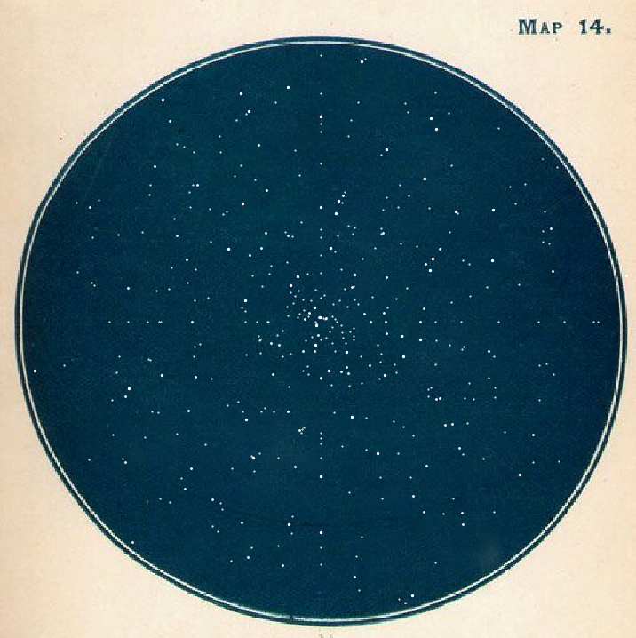

# Star-encryption
A new way to encrypte message that use braille and trigonometric spatial representation.




## Install
* Clone this repository:
```
git clone https://github.com/GaetanDavout/Star-encryption.git
```
* Install the packages and dependencies... (when the file will be created)
```
pip install -r requerements.txt 
```

## Running:

* open it in your favorite python editor.
* everything is explained inside.
* uncomment the last line if you want to save the result while running.

## License

This project is licensed under the MIT License - see the [LICENSE.md](LICENSE.md) file for details

## Authors

* **Gaetan Davout**
